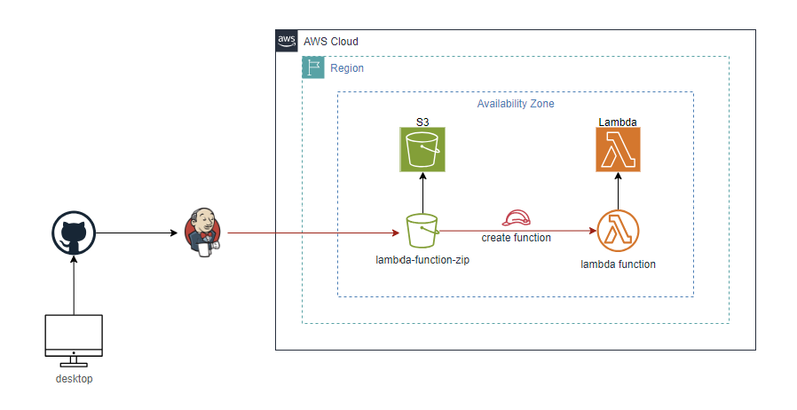

# Desafío 2

Configurar un pipeline de Jenkins que automatice el despliegue de una función lambda escrita en Python en AWS 

### Pre-requisitos 
-	Cuenta de AWS con permisos necesarios para crear y gestionar funciones lambda
-	Instancia de Jenkins instalada y funcionando 
-	AWS CLI configurada en el servidor donde se ejecuta Jenkins 
-	Python y pip instalados en el servidor donde se ejecuta Jenkins 

### Diagrama del desafío

